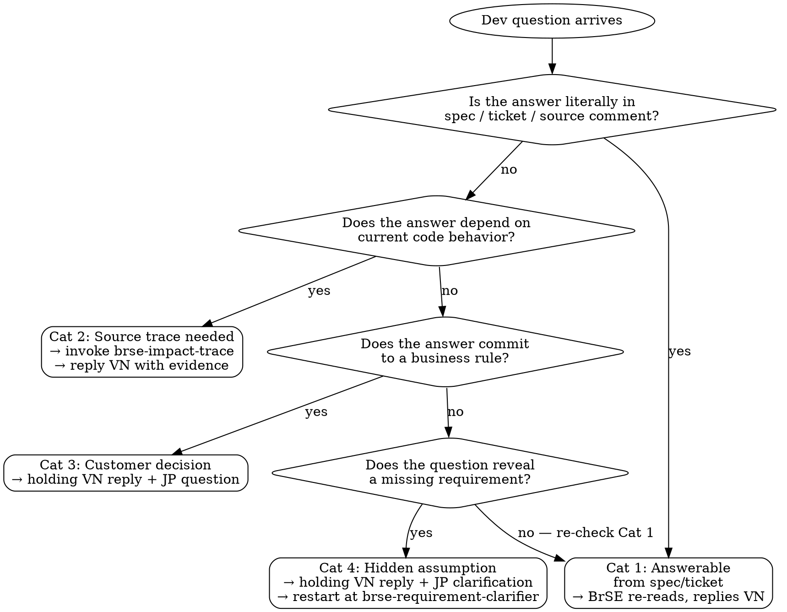

# BrSE Dev Triage

Use this skill when a developer asks the BrSE a question that the spec or ticket does not fully answer. The BrSE must decide: answer now, trace source first, or escalate to customer — and reply in a way that does not block the dev unnecessarily.

## When To Use

- Dev asks "Spec này có nghĩa là gì?" / "実装どっちが正しい？" / "Edge case này xử lý sao?"
- Dev finds that source behavior conflicts with spec.
- Dev needs a decision that the BrSE is not authorized to make alone.

## When NOT To Use

- Question is about implementation technique only (e.g., "how to write this query") — that is dev mentoring, not BrSE triage.
- Question is from a customer to the BrSE — use `brse-requirement-clarifier`.
- Question is about a pure spec ambiguity that has not been triaged through the spec itself — run `brse-spec-verify` against the spec first.
- "Question" is actually a complaint about workload — escalate to PM, not to customer.

## Categorization Flowchart



Apply the flowchart as a strict left-to-right gate. If the answer to `q1` is uncertain, do not skip ahead — re-read the spec.

## Workflow

1. Categorize the question:
   - **Answerable from spec/ticket** — BrSE re-reads source materials and replies.
   - **Answerable from source trace** — BrSE traces code/data before replying (invoke `brse-impact-trace`).
   - **Needs customer decision** — only the customer can resolve.
   - **Hidden assumption** — dev's question reveals a missing requirement; clarify with customer.
2. For categories 1 and 2, draft a Vietnamese reply with evidence and unblock the dev.
3. For categories 3 and 4, draft TWO outputs:
   - Vietnamese holding reply to the dev: explain it needs customer confirmation and the expected timeline.
   - Japanese question to the customer: framed using `brse-client-report` style (conclusion-first, evidence, requested decision).
4. Never leave the dev fully blocked. Either give an interim direction (with the risk noted) or set a clear next checkpoint.
5. If multiple devs may face the same question, suggest where to document the answer (ticket comment, spec doc, FAQ).

## Output Shape

```markdown
## Question Category

(answerable / source-trace needed / customer decision / hidden assumption)

## Reply To Dev (Vietnamese)

## Question To Customer (Japanese) — only when category 3 or 4

## Documentation Suggestion

(where to record the answer for reuse)

## Risk Note

(if dev proceeds before customer confirms)
```

## Rules

- Do not relay a vague dev question to the customer verbatim — translate it into a customer-decidable framing first.
- Do not answer "customer decision" questions from BrSE intuition — escalate.
- For source-trace categories, link the evidence (file path + line) inside the dev reply.
- If the dev's question contradicts the spec, surface the conflict explicitly: "Spec says X, source says Y, please confirm which is correct."
- Vietnamese reply must be specific enough that the dev can act today, not "chờ phản hồi."
- Japanese question to customer must isolate the decision needed, not dump the dev's full context.

## Rationalization Table

| Excuse | Reality |
| ------ | ------- |
| "I am pretty sure the answer is X, just tell dev." | If "pretty sure" needs the word "pretty," escalate. Confident BrSE knowledge does not need hedging. |
| "Customer is in a meeting, just guess and unblock dev." | A wrong unblock costs more than a 1-hour wait. Provide a Risk Note and an interim direction with TODO. |
| "This is a minor detail, customer will not care." | Permission and behavior questions are not minor. They affect data and trust. Escalate. |
| "Dev question is unclear, ask them to clarify first." | The dev question may be unclear *because* the spec is. Diagnose the spec ambiguity, do not bounce the dev. |
| "Relay the dev question verbatim to the customer." | The customer cannot decide from a dev-internal phrasing. Translate to a decidable question. |
| "Dev already implemented one direction, just confirm with customer." | The implementation might be wrong. Ask the customer the actual question, not the leading one. |
| "Multiple devs are stuck, send a long context dump to customer." | Long dumps get partial answers. Isolate the single decision needed. |

## Red Flags — STOP

Stop and re-categorize the question if you notice yourself doing any of these:

- Drafting a Japanese question to the customer that contains internal dev jargon or task IDs the customer does not own.
- Replying to the dev with "chờ phản hồi" without an interim direction.
- Skipping `brse-impact-trace` for a category 2 question because "the answer feels obvious."
- Producing a Risk Note that says "có thể có rủi ro" without naming what changes if the customer's answer is the opposite.
- Sending the customer two unrelated questions in one message — split into two escalations.
- Telling the dev "implement A" while telling the customer "we are considering A or B" — the two replies must be consistent.

## Example

**Dev question (VN):**
> "Trong màn UserProfile, user role `staff` có nhìn thấy nút Edit không? Spec không ghi rõ."

**Output:**

```markdown
## Question Category
Customer decision

## Reply To Dev (Vietnamese)
Spec hiện tại không định nghĩa rõ. Anh đang escalate cho khách hàng. Trong lúc chờ, em implement theo permission hiện tại của hệ thống cũ (staff KHÔNG thấy Edit) — ghi chú TODO trong code để dễ revert nếu khách yêu cầu hiện. Dự kiến có câu trả lời trong 1 ngày làm việc.

## Question To Customer (Japanese)
お世話になっております。UserProfile画面の権限について確認させてください。

- 対象: role = staff のユーザー
- 確認事項: UserProfile画面の「編集」ボタンを表示するか／非表示にするか
- 現行システムの挙動: staff は非表示
- 確認の背景: 今回の改修対象画面でこの権限定義が明記されていないため、現行と同じ「非表示」で実装してよいかご判断をいただけますでしょうか。

## Documentation Suggestion
Plane チケット PRJ-123 のコメントに回答を残し、permission spec シートに追記する。

## Risk Note
If customer answers "show Edit for staff," requires re-permission check on the Edit API.
```

For categorization heuristics and escalation phrasing, read `references/query-types.md`.
