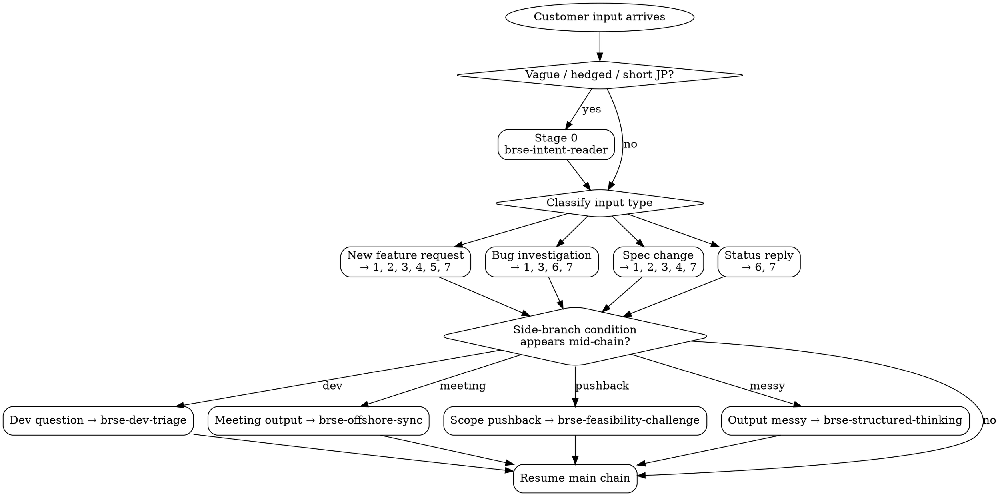

# BrSE Workflow Chain

Use this skill as a meta-orchestrator. It does not replace the domain skills — it tells the BrSE which skill to invoke next and what context to carry between steps.

## When To Use

- New customer request just arrived and BrSE does not yet know the shape of work.
- A vague Japanese spec needs to be turned into dev-ready tickets and a customer reply in one session.
- BrSE wants to ensure no step (clarify / impact / split / QA / report) is skipped.

## When NOT To Use

- The needed work is a single skill in isolation — invoke that skill directly, do not over-orchestrate.
- The BrSE is mid-chain in a previous run and wants to continue — resume the active chain instead of restarting.
- The input is so small that running the chain costs more than the value (e.g., a one-line status reply) — invoke `brse-client-report` only.
- The task is meta-work on the skill set itself — use `brse-skill-author`, not the chain.

## Classification Flowchart



Confirm the classification with the BrSE before chaining. Side-branch conditions pause — they do not skip — the main chain.

## Chain Stages

```
Stage 0 — Read intent    →  brse-intent-reader         (conditional: vague/short JP input)
Stage 1 — Clarify        →  brse-requirement-clarifier
Stage 2 — Verify spec    →  brse-spec-verify           (gate before handing to dev or transfer)
Stage 3 — Trace impact   →  brse-impact-trace
Stage 4 — Break tickets  →  brse-ticket-breakdown
Stage 5 — Design QA      →  brse-qa-scenario
Stage 6 — Verify report  →  brse-report-reviewer       (when dev reports back)
Stage 7 — Report customer→  brse-client-report
```

**Side branches** (invoke when condition is met, outside the main chain):

```
Output of any stage is messy →  brse-structured-thinking  (apply before moving to next stage)
Dev question arrives         →  brse-dev-triage
Meeting / daily sync output  →  brse-offshore-sync
PM / customer pushes scope   →  brse-feasibility-challenge
```

Not every chain runs all stages. The skill decides the minimum useful path.

## Workflow

1. Check if Stage 0 is needed: if the customer input is vague, very short, or contains indirect Japanese phrasing (hedging, omissions, polite indirection) — invoke `brse-intent-reader` first to surface unstated expectations before clarifying.
2. Read the customer input and classify it:
   - **New feature request** → Stages 1, 2, 3, 4, 5, 7
   - **Bug investigation request** → Stages 1, 3, 6, 7
   - **Spec change** → Stages 1, 2, 3, 4, 7
   - **Status reply** → Stages 6, 7
3. Confirm classification with the BrSE before chaining (one short question).
4. For each stage, state:
   - Which skill to invoke
   - What input the skill needs from the previous stage
   - What output it must produce to feed the next stage
5. Run stages one at a time. Do not skip ahead even if the next answer feels obvious.
6. At each stage handoff, write a short bridge note: "From Stage X we have A, B, C — Stage Y needs A as input."
7. If a side-branch condition is met during the chain (dev question, meeting output, scope pushback), pause the main chain, handle the side branch, then resume.
8. If a stage uncovers a blocker (missing customer info, missing source access), stop the chain and surface the blocker; do not fabricate input for the next stage.

## Output Shape

```markdown
## Classification

(new feature / bug investigation / spec change / status reply)

## Planned Chain

1. Stage X — skill — purpose
2. ...

## Current Stage Output

(content from the active skill)

## Handoff Note

To next stage: ...
Blockers: ...
```

## Rules

- Do not invoke multiple skills in parallel. The chain is sequential because each output is input to the next.
- Do not collapse two stages into one even when they look similar (clarify vs trace, breakdown vs QA).
- If `brse-structured-thinking` would improve a stage output, invoke it before moving on, not after the chain ends.
- Stop the chain immediately if Stage 1 produces unresolved open questions that block downstream work — do not "best guess" through to Stage 7.
- For bug-investigation chains: if Stage 3 (impact-trace) reveals the bug originates from a spec defect (not a code defect), restart at Stage 2 (spec-verify) with the corrected requirement.
- Use Vietnamese for internal handoff notes; use Japanese only when the artifact is for the customer.

## Rationalization Table

| Excuse | Reality |
| ------ | ------- |
| "Stages 1 and 3 are clear from the customer message, skip 2." | The verify gate exists to catch invented facts that the clarifier introduced. Run it. |
| "Customer needs reply in 30 min — go straight to client-report." | A fast wrong report damages trust more than a slower correct one. Run the chain. |
| "Dev already implemented this, I will skip impact-trace." | Existing code is exactly when impact-trace matters — it shows what is actually wired, not what the ticket assumed. |
| "Bug investigation, I do not need QA scenario at the end." | QA scenario locks in the fix's verification. Skip and the same bug recurs. |
| "I will run clarifier and breakdown in parallel to save time." | Breakdown without confirmed AC produces tickets that change scope after dev starts. |
| "Stage X output looked obvious so I extrapolated Stage Y output." | Each stage produces an artifact that downstream stages consume. Extrapolation hides the gate. |

## Red Flags — STOP

Stop and return to the active stage if you notice yourself doing any of these:

- Writing customer-facing Japanese before Stage 7 (client-report) is reached.
- Producing a ticket breakdown before clarifier has resolved Open Questions.
- Skipping spec-verify because "the clarifier output looks good."
- Mixing internal Vietnamese guidance into the customer-facing JP output.
- Drafting a handoff note that uses vague phrases like "approximately" / "around" / "should be" — chain handoff requires concrete artifacts.
- Adding a stage that is not in the planned chain "to be safe" — if the side branch is needed, pause the chain and run it explicitly.

## Example: Bug investigation chain

**Customer input (JP):** 「マイページが表示されない件、状況を教えてください」

```
Classification: Bug investigation

Planned chain:
1. brse-requirement-clarifier  — pin down: which tenant, which screen, since when, reproducible?
2. brse-impact-trace           — trace user profile route + permission + tenant config
3. brse-report-reviewer        — verify dev's investigation report meets 6 criteria
4. brse-client-report          — draft JP reply with conclusion-first structure

Skipped: ticket-breakdown (no implementation yet), qa-scenario (investigation phase)
```

For chain templates by request type, read `references/chains.md`.
